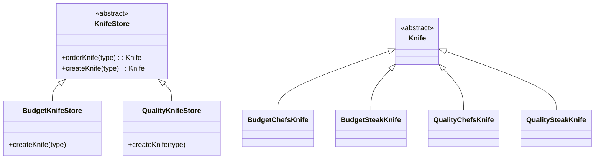

# Factory Method Pattern: Budget and Quality Knives

## Overview

The Factory Method Pattern is a creational design pattern that defines an interface for creating objects but allows subclasses to decide which class to instantiate. This pattern is useful for promoting loose coupling and flexibility in object creation.

## UML

## Code Structure

### Abstract Classes

- **KnifeStore**: An abstract class that provides a method `orderKnife()`, which manages the creation and preparation of a knife. It declares an abstract method `createKnife()`, which must be implemented by subclasses to specify the type of knife to create.

- **Knife**: An abstract class representing the product to be created. It defines essential operations such as `sharpen()`, `polish()`, and `pack()`.

### Concrete Classes

- **BudgetKnifeStore**: A subclass of `KnifeStore` that implements the `createKnife()` method to produce budget knives like `BudgetChefsKnife` and `BudgetSteakKnife`.

- **QualityKnifeStore**: Another subclass of `KnifeStore` that implements the `createKnife()` method to produce quality knives like `QualityChefsKnife` and `QualitySteakKnife`.

- **BudgetChefsKnife** and **BudgetSteakKnife**: Concrete implementations of the `Knife` class, representing specific budget knives.

- **QualityChefsKnife** and **QualitySteakKnife**: Concrete implementations of the `Knife` class, representing specific quality knives.

## How It Works

1. **Client Interaction**: The client interacts with the `KnifeStore` interface to order a knife. The client does not need to know the specifics of which knife is being created.

2. **Order Process**: The `orderKnife()` method in `KnifeStore` handles the overall process of creating and preparing a knife. It calls the `createKnife()` method to get an instance of a specific knife.

3. **Factory Method**: The `createKnife()` method is the factory method. It is abstract in the `KnifeStore` class and must be implemented by subclasses like `BudgetKnifeStore` and `QualityKnifeStore`. This method decides which concrete knife to instantiate based on input parameters.

4. **Knife Creation**: The `BudgetKnifeStore` and `QualityKnifeStore` classes implement the `createKnife()` method to return instances of their respective knife types.

5. **Knife Preparation**: Once a knife is created, the `orderKnife()` method proceeds to sharpen, polish, and pack the knife, using the methods defined in the `Knife` interface.

## Benefits

- **Flexibility**: The pattern allows adding new types of knives without modifying existing code, adhering to the Open/Closed Principle.
- **Encapsulation**: The creation logic is encapsulated in subclasses, promoting cleaner and more maintainable code.
- **Loose Coupling**: Clients interact with abstract interfaces rather than concrete implementations, reducing dependencies.

This pattern is particularly useful in scenarios where a class cannot anticipate the class of objects it must create, or when subclasses should specify the objects to be created.
