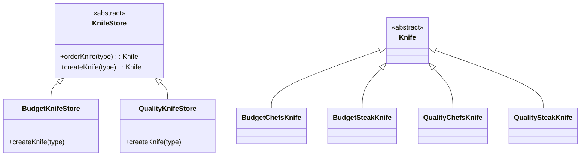

# Factory Method Pattern: Budget and Quality Knives

## Overview

The Factory Method Pattern is a creational design pattern that defines an interface for creating objects but allows subclasses to decide which class to instantiate. This pattern is useful for promoting loose coupling and flexibility in object creation.

## UML



## Code Structure

### Abstract Classes

- **KnifeStore**: An abstract class that provides a method `orderKnife()`, which manages the creation and preparation of a knife. It declares an abstract method `createKnife()`, which must be implemented by subclasses to specify the type of knife to create.

- **Knife**: An abstract class representing the product to be created. It defines essential operations such as `sharpen()`, `polish()`, and `pack()`.

### Concrete Classes

- **BudgetKnifeStore**: A subclass of `KnifeStore` that implements the `createKnife()` method to produce budget knives like `BudgetChefsKnife` and `BudgetSteakKnife`.

- **QualityKnifeStore**: Another subclass of `KnifeStore` that implements the `createKnife()` method to produce quality knives like `QualityChefsKnife` and `QualitySteakKnife`.

- **BudgetChefsKnife** and **BudgetSteakKnife**: Concrete implementations of the `Knife` class, representing specific budget knives.

- **QualityChefsKnife** and **QualitySteakKnife**: Concrete implementations of the `Knife` class, representing specific quality knives.

## How It Works

1. **Client Interaction**: The client interacts with the `KnifeStore` interface to order a knife. The client does not need to know the specifics of which knife is being created.

2. **Order Process**: The `orderKnife()` method in `KnifeStore` handles the overall process of creating and preparing a knife. It calls the `createKnife()` method to get an instance of a specific knife.

3. **Factory Method**: The `createKnife()` method is the factory method. It is abstract in the `KnifeStore` class and must be implemented by subclasses like `BudgetKnifeStore` and `QualityKnifeStore`. This method decides which concrete knife to instantiate based on input parameters.

4. **Knife Creation**: The `BudgetKnifeStore` and `QualityKnifeStore` classes implement the `createKnife()` method to return instances of their respective knife types.

5. **Knife Preparation**: Once a knife is created, the `orderKnife()` method proceeds to sharpen, polish, and pack the knife, using the methods defined in the `Knife` interface.

## Benefits

- **Flexibility**: The pattern allows adding new types of knives without modifying existing code, adhering to the Open/Closed Principle.
- **Encapsulation**: The creation logic is encapsulated in subclasses, promoting cleaner and more maintainable code.
- **Loose Coupling**: Clients interact with abstract interfaces rather than concrete implementations, reducing dependencies.

This pattern is particularly useful in scenarios where a class cannot anticipate the class of objects it must create, or when subclasses should specify the objects to be created.


# Practical Examples of the Factory Method Design Pattern

The **Factory Method design pattern** is used in software development to abstract object creation from the client, allowing the client to work with interfaces or abstract classes rather than concrete implementations. Below are some practical examples where this pattern is widely applied:

## 1. Database Connections

In an application that connects to different databases (e.g., PostgreSQL, MySQL, MongoDB), the Factory Method pattern can be used to create the appropriate database connection without exposing the client to the specific database details.

```java
public interface DatabaseConnection {
    void connect();
}

public class PostgresConnection implements DatabaseConnection {
    public void connect() {
        // PostgreSQL connection logic
    }
}

public class MySQLConnection implements DatabaseConnection {
    public void connect() {
        // MySQL connection logic
    }
}

public abstract class DatabaseFactory {
    public abstract DatabaseConnection createConnection();
}

public class PostgresFactory extends DatabaseFactory {
    public DatabaseConnection createConnection() {
        return new PostgresConnection();
    }
}

public class MySQLFactory extends DatabaseFactory {
    public DatabaseConnection createConnection() {
        return new MySQLConnection();
    }
}
```

### 2. Loggers

Logging frameworks often use the Factory Method to decide which logger to create, depending on the log type or environment (e.g., console vs file logging).

```java
public interface Logger {
    void log(String message);
}

public class ConsoleLogger implements Logger {
    public void log(String message) {
        System.out.println("Console log: " + message);
    }
}

public class FileLogger implements Logger {
    public void log(String message) {
        // File logging logic
    }
}

public class LoggerFactory {
    public static Logger getLogger(String type) {
        if (type.equals("console")) {
            return new ConsoleLogger();
        } else if (type.equals("file")) {
            return new FileLogger();
        }
        throw new IllegalArgumentException("Invalid logger type");
    }
}

```

### 3. Document Processing Systems

In systems that handle different types of documents (e.g., Word, PDF, Excel), a Factory Method can be used to create the appropriate document parser based on the file type.

```java
public interface DocumentParser {
    void parse(String filePath);
}

public class WordParser implements DocumentParser {
    public void parse(String filePath) {
        // Word parsing logic
    }
}

public class PDFParser implements DocumentParser {
    public void parse(String filePath) {
        // PDF parsing logic
    }
}

public class ExcelParser implements DocumentParser {
    public void parse(String filePath) {
        // Excel parsing logic
    }
}

public class DocumentParserFactory {
    public static DocumentParser getParser(String fileType) {
        switch (fileType.toLowerCase()) {
            case "word": return new WordParser();
            case "pdf": return new PDFParser();
            case "excel": return new ExcelParser();
            default: throw new IllegalArgumentException("Unknown file type");
        }
    }
}

```
